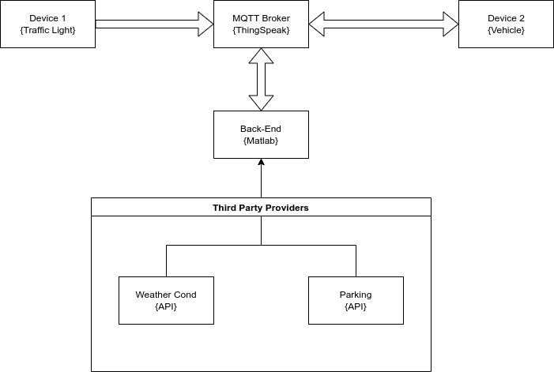

# Interface definition

- [Interface definition](#interface-definition)
  - [MQTT protocolo](#mqtt-protocolo)
  - [Vehicle](#vehicle)
    - [Vehicle position (vh\_position)](#vehicle-position-vh_position)
    - [Vehicle weather request (vh\_weather)](#vehicle-weather-request-vh_weather)
    - [Vehicle parking request (vh\_parking)](#vehicle-parking-request-vh_parking)
  - [Traffic Light](#traffic-light)
    - [Traffic light information (tl\_status)](#traffic-light-information-tl_status)
  - [Back-End](#back-end)
    - [Weather condition (bk\_weather)](#weather-condition-bk_weather)
    - [Parking spot status (bk\_parking)](#parking-spot-status-bk_parking)
    - [Collision warning (bk\_collision)](#collision-warning-bk_collision)
    - [Traffic Light status (bk\_tl\_status)](#traffic-light-status-bk_tl_status)

## MQTT protocolo

MQTT protocol is used as its light weight and supports multiple IoT devices communicating at the same time. This protocol allow us to send up to **256MiB** which is enough for the expected usage.



## Vehicle

### Vehicle position (vh_position)

Message send by the vehicle each **\<seconds>** to the topic **TDB**

#### Details 
| Name | Type | Size | Detail |
| ---- | ---- | ---- | ------ |
| Id | int | - | Id of the vehicle |
| Position | float array | 2 | Latitud and Longitude of the vehicle |

#### Example

```json
{
    "Id": 1,
    "Position": [48.738534, 9.311124]
}
```

### Vehicle weather request (vh_weather)

Message send by the vehicle each time the weather is needed to the topic **weather/info**

#### Details 
| Name | Type | Size | Detail |
| ---- | ---- | ---- | ------ |
| Id | int | - | Id of the vehicle |
| Position | float array | 2 | Latitud and lingitude of the request |

#### Example

```json
{
    "Id": 1,
    "Position": [48.738534, 9.311124]
}
```

### Vehicle parking request (vh_parking)

Message send to the topic **parking/info** by the vehicle each each time a parking spot is needed.

#### Details 
| Name | Type | Size | Detail |
| ---- | ---- | ---- | ------ |
| Id | int | - | Id of the vehicle |
| Position | float array | 2 | Latitud and longitude of the request |

#### Example

```json
{
    "Id": 1,
    "Destination": [48.738534, 9.311124]
}
```

## Traffic Light
### Traffic light information (tl_status)

Message send by the traffic light each **300ms** to the topic **trafficLight/info/{id}**

#### Details 
| Name | Type | Size | Detail |
| ---- | ---- | ---- | ------ |
| Id | int | - | Id of the traffic light |
| Status | int | - | 0: Green, 1: Red, 2: Yellow, 3: Prepare |
| Position | float array | 2 | Latitud and longitude of the traffic light position |
| Time_to_Change | int | - | Time for the status to change |


#### Example
```json
{
    "Id": 1,
    "Status": 2,
    "Position": [48.738534, 9.311124],
    "Time_to_Change": 100
}
```
## Back-End
### Weather condition (bk_weather)

Message send by the back-end to the topic **weather/info/response** each time a request for weather is received.

#### Details 
| Name | Type | Size | Detail |
| ---- | ---- | ---- | ------ |
| Condition | int | - | 0: Good, 1: Regular, 2: Bad, 3: Very Bad|
| Temperature | float | - | Current ambient temperature <C°> |

#### Example
```json
{
    "Condtion": 1,
    "Temperature": 20
}
```
### Parking spot status (bk_parking)

Message send by the back-end to the topic **parking/info/response** each time a request for a parking spot is recieved.

#### Details 
| Name | Type | Size | Detail |
| ---- | ---- | ---- | ------ |
| Available | boolean | - | Indicates if a parking spot is available at the requested location |

#### Example
```json
{
    "Available": 1,
}
```

### Collision warning (bk_collision)

Message send by the back-end to the topic **vehicle/collision/{id}** each time a possible collision is detected.

#### Details 
| Name | Type | Size | Detail |
| ---- | ---- | ---- | ------ |
| Warning | boolean | - | Indicated whether is a warning or not |
| Direction | float | - | Direction of object |

#### Example
```json
{
    "Warning": 1,
    "Direction": 20
}
```


### Traffic Light status (bk_tl_status)

Message send by the back-end to the topic **vehicle/trafficLight/{id}** each time a vehicle is close to a traffic light.

This message will stop for **\<meters>** for a vehicle after crossing a traffic light.

#### Details 
| Name | Type | Size | Detail |
| ---- | ---- | ---- | ------ |
| Id | boolean | - | Id of the traffic light |
| Status | int | - | Current status of the traffic light |
| Time_to_Change | int | - | Time for the traffic light to change its status |
| Distance | int | - | Current distance to the traffic light |

#### Example
```json
{
    "Id": 1,
    "Status": 2,
    "Time_to_Change": 20,
    "Distance": 20,
}
```
